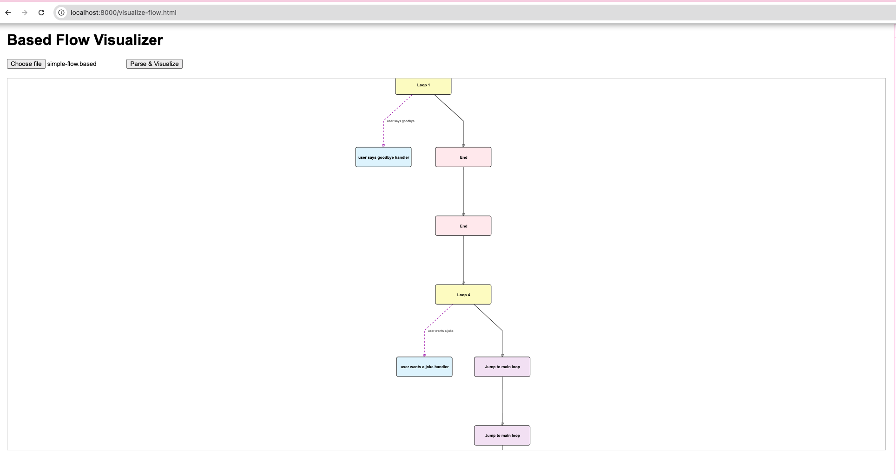

# Brainbase Automated Testing Suite


A comprehensive testing framework for Brainbase's Based language that automatically tests all possible conversation paths in your AI flows.

## 📋 Table of Contents

- [Overview](#overview)
- [Features](#features)
- [Installation](#installation)
- [Quick Start](#quick-start)
- [Usage Guide](#usage-guide)
  - [Command Line](#command-line)
  - [API Testing](#api-testing)
  - [Visualization](#visualization)
  - [End-to-End Testing](#end-to-end-testing)
- [Debugging](#debugging)
- [API Reference](#api-reference)
- [Examples](#examples)
- [Troubleshooting](#troubleshooting)
- [Contributing](#contributing)
- [License](#license)

## 🔍 Overview

The Brainbase Automated Testing Suite helps you ensure your conversational AI flows work correctly in all scenarios. It parses Based code, identifies all possible conversation paths, generates test scenarios, and executes tests against the Brainbase Engine.

## ✨ Features

- **Comprehensive Path Analysis**: Automatically identifies all possible conversation paths
- **Scenario Generation**: Creates realistic test scenarios for each path
- **Automated Testing**: Runs tests against the Brainbase Engine
- **Visual Debugging**: Interactive visualization of conversation flows
- **API-First Design**: Full functionality available via RESTful API

## 🚀 Installation

```bash
# Clone the repository
git clone https://github.com/brainbase/test-suite.git
cd brainbase-test-suite

# Install dependencies
npm install

# Build the project
npm run build
```

## ⚡ Quick Start

```bash
# Start the server
npm start

# Run the example test
cd examples
./run-example.sh

# Open the visualization tool
cd examples
./open-visualizer.sh
```

## 📖 Usage Guide

### Command Line

Run the example test script:

```bash
cd examples
./run-example.sh
```

This will:
1. Build the project
2. Start the server
3. Run tests on the example Based flow
4. Output the results

### Visualization in the Browser

To visualize your Based flows in the browser:

1. Start the server:
   ```bash
   npm start
   ```

2. Start a local HTTP server for the visualization tool:
   ```bash
   cd examples
   python3 -m http.server 8000
   ```

3. Open your browser and navigate to:
   ```
   http://localhost:8000/visualize-flow.html
   ```

4. Upload a Based file (e.g., `simple-flow.based`) and click "Parse & Visualize"

5. You should see a visualization like this:

   

   *The visualization shows nodes (conversation points) connected by edges (transitions) with different colors representing different node types.*

#### Understanding the Visualization

- **Blue nodes**: Based code blocks
- **Yellow nodes**: Loop-until blocks
- **Green nodes**: If conditions
- **Red nodes**: End nodes
- **Purple nodes**: Jump nodes
- **Solid blue lines**: Logic conditions
- **Dashed purple lines**: AI conditions

You can zoom in/out using the mouse wheel and pan by clicking and dragging. This visualization helps you understand the structure of your Based flow and identify potential issues or improvements.

### API Testing

Test each API endpoint using curl:

#### 1. Parse Based Code

```bash
curl -X POST http://localhost:3000/based/node \
  -H "Content-Type: application/json" \
  -d '{
    "code": "say(\"Hello\")\nloop:\n  res = talk(\"How are you?\", True)\nuntil \"user says goodbye\":\n  say(\"Goodbye!\")"
  }'
```

#### 2. Generate Paths

```bash
curl -X POST http://localhost:3000/based/paths \
  -H "Content-Type: application/json" \
  -d '{
    "nodes": [...],
    "edges": [...]
  }'
```

#### 3. Generate Scenarios

```bash
curl -X POST http://localhost:3000/based/scenario \
  -H "Content-Type: application/json" \
  -d '{
    "path": [...],
    "nodes": [...],
    "count": 2
  }'
```

#### 4. Run Tests

```bash
curl -X POST http://localhost:3000/based/test \
  -H "Content-Type: application/json" \
  -d '{
    "scenario": {...},
    "apiKey": "your-api-key",
    "flowId": "your-flow-id",
    "queue": true
  }'
```

#### 5. Get Test Results

```bash
curl -X GET http://localhost:3000/based/test/test_1234567890_123
```

#### 6. All-in-One Analysis

```bash
curl -X POST http://localhost:3000/based/analyze \
  -H "Content-Type: application/json" \
  -d '{
    "code": "your Based code here",
    "scenarioCount": 2,
    "apiKey": "your-api-key",
    "flowId": "your-flow-id",
    "runTests": true
  }'
```

### Visualization

1. Start the server:
   ```bash
   npm start
   ```

2. Start a local HTTP server for the visualization tool:
   ```bash
   cd examples
   python3 -m http.server 8000
   ```

3. Open your browser and navigate to:
   ```
   http://localhost:8000/visualize-flow.html
   ```

4. Upload a Based file and click "Parse & Visualize"

Alternatively, use the provided script:
```bash
cd examples
./open-visualizer.sh
```

### End-to-End Testing

For complete end-to-end testing:

1. Update the API key and flow ID in `examples/test-flow.js`:
   ```javascript
   const BRAINBASE_API_KEY = 'your-api-key';
   const BRAINBASE_FLOW_ID = 'your-flow-id';
   ```

2. Run the test script:
   ```bash
   cd examples
   node test-flow.js
   ```

## 🐞 Debugging

### Server Logs

Monitor the server logs for errors:
```bash
npm start
```

### API Response Inspection

Use the `-v` flag with curl to see detailed request/response information:
```bash
curl -v -X POST http://localhost:3000/based/node -H "Content-Type: application/json" -d '{"code": "say(\"Hello\")"}'
```

### Visualization Debugging

If the visualization tool shows errors:

1. Check browser console for JavaScript errors
2. Ensure the server is running
3. Check for CORS issues (the server has CORS enabled)
4. Verify the Based code is valid

### Common Issues

- **"Failed to connect to server"**: Ensure the server is running on port 3000
- **"CORS error"**: The server must be running with CORS enabled
- **"Invalid Based code"**: Check your Based syntax
- **"WebSocket connection failed"**: Verify your API key and flow ID

## 📚 API Reference

### POST /based/node
Parse Based code into nodes and edges

### POST /based/paths
Generate all possible paths through the conversation flow

### POST /based/scenario
Generate test scenarios for a path

### POST /based/test
Run a test for a scenario

### GET /based/test/:id
Get the result of a test

### POST /based/analyze
All-in-one endpoint to analyze Based code

## 📝 Examples

The `examples` directory contains:

- `simple-flow.based`: Example Based flow
- `test-flow.js`: Example script to test a Based flow
- `run-example.sh`: Script to run the example
- `visualize-flow.html`: Web-based visualization tool
- `open-visualizer.sh`: Script to open the visualization tool

## ❓ Troubleshooting

### Visualization Tool Issues

If you encounter the error "dagreD3 is not defined":

1. Ensure you're serving the files through a web server (not opening directly)
2. Check that the library files in `examples/lib` are accessible
3. Try using a different browser

### API Connection Issues

If you can't connect to the API:

1. Verify the server is running (`npm start`)
2. Check for any firewall blocking port 3000
3. Ensure you're using the correct URL (http://localhost:3000)

### Test Execution Issues

If tests fail to execute:

1. Verify your Brainbase API key and flow ID
2. Check the WebSocket connection to Brainbase
3. Ensure your Based flow is deployed and active

## 🤝 Contributing

Contributions are welcome! Please feel free to submit a Pull Request.

## 📄 License

This project is licensed under the MIT License - see the LICENSE file for details.
